# EduZone Database Entity-Relationship Diagram

This document contains the Entity-Relationship (ER) diagram for the EduZone system, reflecting the current MySQL database schema.

## 1. ER Diagram

```mermaid
erDiagram
    %% --- Users & Roles ---
    User {
        int id PK
        string full_name
        string email UK
        string password_hash
        enum role "ZEO, PRINCIPAL, TEACHER, DONOR"
        boolean is_verified
        boolean is_active
        datetime created_at
        datetime updated_at
    }

    PasswordReset {
        int id PK
        int user_id FK
        string token_hash
        datetime expires_at
        boolean used
        datetime created_at
    }

    Notification {
        int id PK
        int user_id FK
        string title
        text message
        boolean is_read
        datetime created_at
        datetime updated_at
    }

    %% --- Schools & Staff ---
    School {
        int id PK
        string name UK
        text address
        string division
        string bank_name
        string bank_branch
        string account_number
        string account_holder
        datetime created_at
        datetime updated_at
    }

    Principal {
        int id PK
        int user_id FK
        int school_id FK
        string contact_number
        datetime created_at
        datetime updated_at
    }

    Teacher {
        int id PK
        int user_id FK
        int school_id FK
        string contact_number
        datetime created_at
        datetime updated_at
    }

    Donor {
        int id PK
        int user_id FK
        string organization_name
        string contact_number
        datetime created_at
        datetime updated_at
    }

    %% --- Academics ---
    Student {
        int id PK
        int school_id FK
        string full_name
        string grade
        string section
        datetime created_at
        datetime updated_at
    }

    Subject {
        int id PK
        string name UK
    }

    TeacherSubject {
        int teacher_id PK, FK
        int subject_id PK, FK
    }

    Resource {
        int id PK
        int teacher_id FK
        int subject_id FK
        int school_id FK
        string title
        text description
        string grade
        string file_url
        enum status "PUBLISHED, REMOVED"
        datetime created_at
        datetime updated_at
    }

    MonthlyReport {
        int id PK
        int school_id FK
        date report_month
        decimal avg_attendance
        decimal staff_attendance
        int dropout_count
        text remarks
        datetime created_at
        datetime updated_at
    }

    %% --- Welfare & Donations ---
    WelfareRequest {
        int id PK
        string reference_code UK
        int student_id FK
        int teacher_id FK
        int school_id FK
        enum category "Supplies, Fees, Uniforms..."
        text description
        decimal amount_required
        enum status "SUBMITTED, PRINCIPAL_APPROVED, ZEO_APPROVED, PUBLISHED..."
        enum priority "LOW, MEDIUM, HIGH"
        datetime created_at
        datetime updated_at
    }

    WelfareRequestDocument {
        int id PK
        int welfare_request_id FK
        string file_url
        datetime uploaded_at
    }

    WelfareApproval {
        int id PK
        int welfare_request_id FK
        int approved_by FK
        enum role "PRINCIPAL, ZEO"
        enum decision "APPROVED, REJECTED"
        text remarks
        datetime created_at
        datetime updated_at
    }

    Donation {
        int id PK
        int donor_id FK
        int welfare_request_id FK
        int school_id FK
        decimal amount
        enum payment_method "ONLINE, BANK_TRANSFER"
        enum status "PENDING, VERIFIED, REJECTED"
        string receipt_reference
        datetime created_at
        datetime updated_at
    }

    Transfer {
        int id PK
        int welfare_request_id FK
        int donation_id FK
        int school_id FK
        decimal amount
        string transfer_reference
        string proof_url
        int transferred_by FK
        datetime transferred_at
    }

    %% --- Circulars ---
    Circular {
        int id PK
        string title
        text message
        enum status "DRAFT, PUBLISHED"
        int published_by FK
        datetime published_at
        datetime created_at
        datetime updated_at
    }

    CircularRecipient {
        int circular_id PK
        enum role PK "PRINCIPAL or TEACHER"
    }

    CircularAttachment {
        int id PK
        int circular_id FK
        string file_url
    }

    %% --- Relationships ---

    %% User Relationships
    User ||--o{ PasswordReset : "requests"
    User ||--o{ Notification : "receives"
    User ||--|| Principal : "has profile"
    User ||--|| Teacher : "has profile"
    User ||--|| Donor : "has profile"
    User ||--o{ WelfareApproval : "issues"
    User ||--o{ Circular : "publishes"
    User ||--o{ Transfer : "processes"

    %% School Relationships
    School ||--|| Principal : "managed by"
    School ||--o{ Teacher : "employs"
    School ||--o{ Student : "educates"
    School ||--o{ WelfareRequest : "verifies"
    School ||--o{ Resource : "owns"
    School ||--o{ MonthlyReport : "generates"
    School ||--o{ Transfer : "receives funds"
    School ||--o{ Donation : "receives general funds"

    %% Teacher Relationships
    Teacher ||--o{ TeacherSubject : "teaches"
    Teacher ||--o{ WelfareRequest : "identifies"
    Teacher ||--o{ Resource : "creates"
    
    %% Subject Relationships
    Subject ||--o{ TeacherSubject : "taught by"
    Subject ||--o{ Resource : "categorizes"

    %% Student Relationships
    Student ||--o{ WelfareRequest : "needs"

    %% Welfare Request Relationships
    WelfareRequest ||--o{ WelfareRequestDocument : "has evidence"
    WelfareRequest ||--o{ WelfareApproval : "audit trail"
    WelfareRequest ||--o{ Donation : "funded by"
    WelfareRequest ||--o{ Transfer : "fulfilled by"

    %% Donation Relationships
    Donation ||--o| Transfer : "triggers"
    Donor ||--o{ Donation : "makes"

    %% Circular Relationships
    Circular ||--o{ CircularRecipient : "targets"
    Circular ||--o{ CircularAttachment : "includes"
```

## 2. Schema Analysis & Logical Improvements

### Key Corrected Logic
1.  **Donation Model (General Funds)**:
    -   *Issue*: Originally, `Donation` rigidly required a `welfareRequestId`, making general donations (e.g., "School Development Fund") impossible to model despite being part of the requirements.
    -   *Correction*: Modified `Donation` to make `welfareRequestId` nullable and added `schoolId` (nullable). This allows a donation to be linked *either* to a specific request OR directly to a school.

2.  **Role-Based Access**:
    -   The `User` table serves as the central identity provider. Specific profiles (`Principal`, `Teacher`, `Donor`) are separate tables (1-to-1) containing role-specific data (e.g., `appointmentDate` for Principals), ensuring a clean separation of concerns.

3.  **Audit Trails**:
    -   `WelfareApproval` acts as a history log for State transitions of a request, capturing *who* (Principal or ZEO) changed the status and *when*.

4.  **Financial Integrity**:
    -   `Transfer` table explicitly links a `Donation` (Source of funds) to a `School` (Destination) via a `WelfareRequest` (Purpose). This traceability ensures that every rupee transferred can be tracked back to the original donor receipt.
