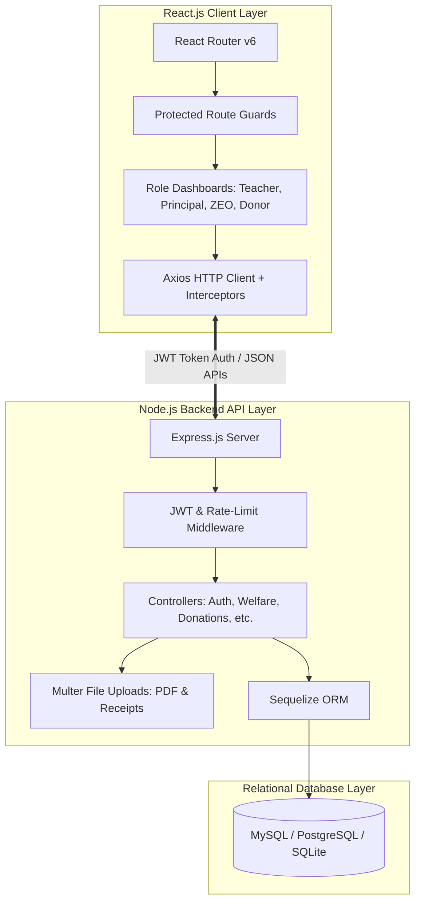
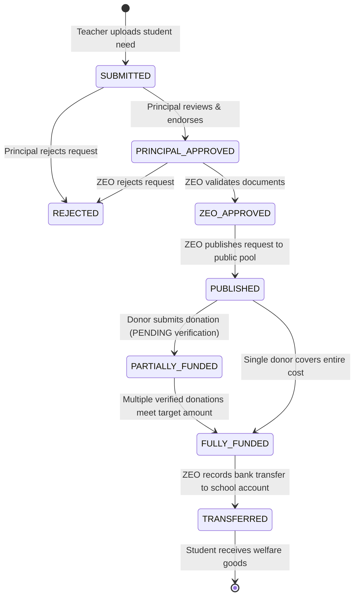
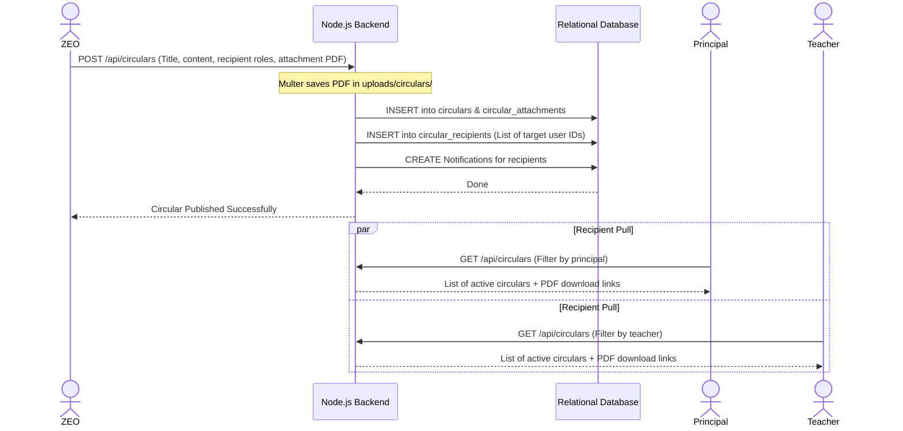
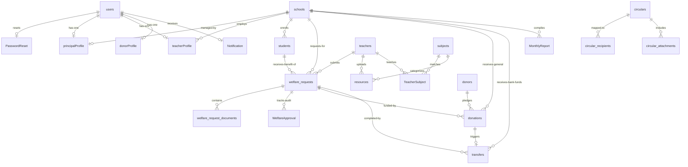

# 🎓 EduZone: System Architecture, Business Flows, and Database Model Documentation
**A Comprehensive System Design Report for Academic and Practical Reference**

---

## 📝 1. Executive Summary & Project Purpose

**EduZone** is a centralized, role-based digital management and crowdfunding platform designed to revolutionize educational resource sharing, official administration, and student welfare within a specific school zone. 

### The Problem
Traditional educational support systems suffer from a lack of transparency, slow bureaucratic pipelines, and fragmentation. Teachers identify needy students but lack direct channels to report requirements; generous donors want to help but suffer from donor skepticism due to lack of traceability; and zonal administrators struggle to distribute official announcements (circulars) and monitor school progress reports in a unified way.

### The Solution
EduZone solves these issues by bringing four key system actors onto a single relational platform:
1. **Teachers** (who submit vetted student needs).
2. **Principals** (who verify and endorse these needs at the school level).
3. **Zonal Education Officers (ZEO)** (who act as final auditors, verifying donation receipts and executing official bank transfers).
4. **Donors** (who transparently fund requests and upload receipt proof).

---

## 🏗️ 2. High-Level System Architecture

EduZone is built on a decoupled, modern **PERN/MERN-style Relational Stack**:



### Key Architectural Pillars:
*   **React Router v6 Nested Route Guards:** Routes are protected dynamically. If a user logs in as a `Teacher` and attempts to navigate to `/zeo/dashboard`, the system catches the mismatch and redirects them to an `/unauthorized` landing page.
*   **JWT Access/Refresh Flow:** Utilizes short-lived JWT access tokens stored in memory for authentication headers, with automatic renewal via secure HTTP-Only refresh cookies to avoid user session interruptions.
*   **Sequelize ORM:** Enforces clean, typed, relational mappings using models and manages ACID transaction blocks for operations that alter multiple database records simultaneously.

---

## 👥 3. Actor Roles & Permissions Matrix

The system maps all users to one of four roles. Below is a comprehensive feature-capability checklist:

| Feature Area | Teacher | Principal | ZEO Admin | Public / Donor |
| :--- | :---: | :---: | :---: | :---: |
| **Self-Registration** | ❌ | ❌ | ❌ | **Yes** (Donors only) |
| **Account Activation (via ZEO)** | ❌ | ❌ | **Yes** (Creates users) | ❌ |
| **Submit Welfare Request** | **Yes** | ❌ | ❌ | ❌ |
| **Endorse Request (School level)** | ❌ | **Yes** | ❌ | ❌ |
| **Approve & Publish Request** | ❌ | ❌ | **Yes** | ❌ |
| **View Published Requests** | **Yes** | **Yes** | **Yes** | **Yes** (Pledge Funds) |
| **Submit Donation Receipt** | ❌ | ❌ | ❌ | **Yes** (Donors only) |
| **Verify Receipts & Complete Transfers**| ❌ | ❌ | **Yes** | ❌ |
| **Upload Study Resources** | **Yes** | ❌ | ❌ | ❌ |
| **Download shared Resources** | **Yes** | ❌ | ❌ | **Yes** (Read-Only) |
| **Upload Monthly School Report** | ❌ | **Yes** | ❌ | ❌ |
| **Review Monthly Reports** | ❌ | ❌ | **Yes** | ❌ |
| **Publish Official Circulars** | ❌ | ❌ | **Yes** | ❌ |
| **Read Circulars** | **Yes** | **Yes** | ❌ | ❌ |

---

## 🔄 4. Core Business Flows (Step-by-Step)

Here are the four primary functional workflows that drive the platform.

### Flow A: Welfare Request & Funding Lifecycle (The Core Pipeline)

This is the system's most complex pipeline, guiding a student's material needs from inception to fulfillment.



#### Step-by-Step Breakdown:
1. **Submission:** A **Teacher** logs into the portal, selects a student registered in their school, chooses a category (e.g., *Fees, Medical, Transport, Uniforms*), enters the description, estimated cost (`amountRequired`), and uploads supporting PDFs. The request status is set to `SUBMITTED`.
2. **School-level Vetting:** The school's **Principal** views pending requests on `/principal/review-requests`. They inspect details and approve. The status becomes `PRINCIPAL_APPROVED`. (If suspicious, they mark it `REJECTED`).
3. **Zonal Audit & Publication:** The **ZEO** receives the request at `/zeo/welfare-approval`. The ZEO verifies the legitimacy of the request and changes status to `ZEO_APPROVED`, then clicks Publish, moving the status to `PUBLISHED`. It is now visible to the public.
4. **Pledging Donations:** A **Donor** browses `/donor/browse-requests`. They choose a request, enter an amount, select `BANK_TRANSFER` or `ONLINE`, and upload the bank slip as receipt proof. A `Donation` record is created in a `PENDING` state.
5. **Receipt Verification:** The **ZEO** views the uploaded receipt proof under `/zeo/donations`. Upon matching the slip with the zonal bank statement, they click "Verify".
    *   *Sequelize Transaction Action:* The donation status becomes `VERIFIED`. The matching welfare request's total raised amount is incremented.
    *   The welfare request transitions to `PARTIALLY_FUNDED` or `FULLY_FUNDED` depending on whether the target amount has been met.
6. **Disbursement/Transfer:** Once a request is `FULLY_FUNDED`, the **ZEO** physically transfers the accumulated funds from the central zonal account to the target school's bank account. They record this transaction on the dashboard, uploading a transfer receipt. A `Transfer` record is created, and the welfare request status updates to `TRANSFERRED` (Fulfilling the loop).

---

### Flow B: Official Circular Dispatch Channels
ZEOs must disperse directives, schedules, and administrative circulars to schools efficiently.



---

### Flow C: Collaborative Educational Resource Hub
Teachers upload study aids, worksheets, and syllabus documents, allowing public download by students and other educators.

1. **Category Maintenance:** The DB contains a `subjects` table populated with high-school and primary subjects (e.g., *Mathematics, Science, History*).
2. **Resource Upload:** A **Teacher** logs in, goes to `/teacher/upload-resource`, selects the subject, inputs the target grade level, sets a name, and uploads a PDF/Word file.
3. **Database Hook:** The file path is logged in the `resources` table linked to the uploading `Teacher`'s profile, the target `Subject`, and the `School`.
4. **Public Browsing:** The `/resources` route is a public landing page. Donors, students, and other teachers can search, filter by subject or grade, and download the documents.

---

### Flow D: Monthly School Performance Reporting
To maintain administration standards, the ZEO monitors performance metrics at each school.

1. **Submission:** **Principals** must complete monthly reporting. They navigate to `/principal/submit-report`, complete the metrics form (total student count, average attendance, ongoing needs), and submit.
2. **Auditing:** The backend records this in the `MonthlyReport` table. The **ZEO** views `/zeo/reports`, where reports are grouped chronologically. This enables high-level evaluation of school needs.

---

## 🗄️ 5. Relational Database Schema & ER Model

EduZone uses a fully normalized database structure. Below are the core entities, their properties, and structural relationships.

### 5.1. Entity Mappings

#### 1. `users` (Core Actor Registry)
*   `id` (INT, Primary Key, Auto-increment)
*   `full_name` (VARCHAR)
*   `email` (VARCHAR, Unique)
*   `password_hash` (VARCHAR)
*   `role` (ENUM: `'ZEO'`, `'PRINCIPAL'`, `'TEACHER'`, `'DONOR'`)
*   `is_verified` / `is_active` (BOOLEAN)
*   `refresh_token` (VARCHAR, Nullable)
*   `profile_picture` (VARCHAR, Nullable)
*   `phone_number` / `address` (TEXT)

#### 2. `schools` (Educational Facilities)
*   `id` (INT, Primary Key)
*   `name` (VARCHAR)
*   `address` (TEXT)
*   `bank_name` / `account_number` (VARCHAR - for receiving funds)

#### 3. `principals` / `teachers` / `donors` (Role-Specific Profiles)
These tables act as 1:1 extensions of the parent `users` table:
*   `Principal`: Linked to `userId` and `schoolId`. Holds office room/extension numbers.
*   `Teacher`: Linked to `userId` and `schoolId`. Holds teaching credentials.
*   `Donor`: Linked to `userId`. Holds details such as tax numbers or donation preferences.

#### 4. `students` (Welfare Candidates)
*   `id` (INT, Primary Key)
*   `school_id` (INT, Foreign Key referencing `schools.id`)
*   `full_name` (VARCHAR)
*   `grade` (VARCHAR)
*   `parent_name` / `contact_number` (VARCHAR)

#### 5. `welfare_requests` (Assistance Lifecycle Tracker)
*   `id` (INT, Primary Key)
*   `reference_code` (VARCHAR, Unique)
*   `student_id` (INT, Foreign Key referencing `students.id`)
*   `teacher_id` (INT, Foreign Key referencing `teachers.id`)
*   `school_id` (INT, Foreign Key referencing `schools.id`)
*   `category` (VARCHAR)
*   `description` (TEXT)
*   `amount_required` (DECIMAL)
*   `status` (ENUM: `'SUBMITTED'`, `'PRINCIPAL_APPROVED'`, `'ZEO_APPROVED'`, `'PUBLISHED'`, `'PARTIALLY_FUNDED'`, `'FULLY_FUNDED'`, `'TRANSFERRED'`, `'REJECTED'`)
*   `priority` (ENUM: `'LOW'`, `'MEDIUM'`, `'HIGH'`)

#### 6. `donations` (Crowdfunding Transactions)
*   `id` (INT, Primary Key)
*   `donor_id` (INT, Foreign Key referencing `donors.id`)
*   `welfare_request_id` (INT, Foreign Key, Nullable - for specific student needs)
*   `school_id` (INT, Foreign Key, Nullable - for general school funding pools)
*   `amount` (DECIMAL)
*   `payment_method` (ENUM: `'ONLINE'`, `'BANK_TRANSFER'`)
*   `status` (ENUM: `'PENDING'`, `'VERIFIED'`, `'REJECTED'`)
*   `receipt_reference` (VARCHAR - file path to uploaded payment slip)
*   `is_anonymous` (BOOLEAN)

#### 7. `transfers` (Zonal Bank Disbursements)
*   `id` (INT, Primary Key)
*   `welfare_request_id` (INT, Foreign Key referencing `welfare_requests.id`)
*   `donation_id` (INT, Foreign Key referencing `donations.id`)
*   `school_id` (INT, Foreign Key referencing `schools.id`)
*   `amount` (DECIMAL)
*   `transfer_reference` (VARCHAR)
*   `proof_url` (VARCHAR - path to transfer receipt)
*   `transferred_by` (INT, Foreign Key referencing `users.id` - the ZEO user)
*   `transferred_at` (TIMESTAMP)

---

### 5.2. Entity-Relationship (ER) Diagram



---

## 🔒 6. Key Technical Implementations & Security

EduZone is built to production-grade security specifications:

### 1. Robust JWT Autorefresh System
*   **The Problem:** Access tokens expire quickly for security reasons. If the user is mid-action and their token expires, the backend will reject their request. Asking them to log back in repeatedly degrades user experience.
*   **The Implementation:**
    *   On successful login, the server issues two tokens: an **Access Token** (expires in 15 minutes, returned in the JSON body) and a **Refresh Token** (expires in 7 days, sent via a secure, `httpOnly`, `sameSite: 'strict'` cookie).
    *   On the frontend, Axios implements an **interceptors response pipeline**. If an API request fails with a `401 Unauthorized` error, the interceptor pauses the queue, calls the `/api/auth/refresh` endpoint behind the scenes to fetch a new access token, updates the headers, and transparently retries the original failed user request.

### 2. Relational Transaction Safety (ACID Principles)
During payment verification, multiple records must update in lockstep.
*   **The Danger:** If the system updates the donation state to `VERIFIED` but encounters a network disconnect before updating the Welfare Request's collected balance, the database will contain inconsistent, corrupt values.
*   **The Implementation:** The controller wraps these updates in a **Sequelize Transaction**:
    ```javascript
    const result = await sequelize.transaction(async (t) => {
        // 1. Update Donation Status to VERIFIED
        await Donation.update({ status: 'VERIFIED' }, { where: { id }, transaction: t });
        
        // 2. Aggregate funds and update target WelfareRequest
        await WelfareRequest.increment(
            { amountRaised: amount }, 
            { where: { id: welfareRequestId }, transaction: t }
        );
        
        // If both succeed, Sequelize commits the block. If either fails, it rolls back everything.
    });
    ```

### 3. File Path Protection
All files are processed through **Multer**, which filters uploads (disallowing execution scripts like `.js`, `.sh`, `.exe`) and renames attachments using random UUID configurations to avoid directory traversal attacks.

---

### 💡 Recommendation for Your Assignment
*   **Use the Diagrams:** Copy the **Mermaid.js High-Level Architecture Diagram** and the **ER Diagram** into your document. Visual tools score highly in database and systems analysis modules.
*   **Emphasize Workflows:** Use **Flow A (Welfare Crowdfunding)** to explain state machines and data integrity (ACID properties), as this shows a high level of technical understanding.
*   **Detail Routing Guards:** Explaining how React handles role routing (`ProtectedRoute.jsx`) satisfies requirements for demonstrating secure client-side engineering.
